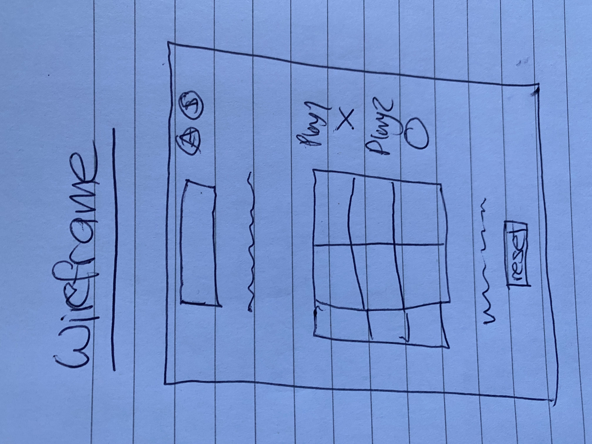

#Tic Tac Toe - Franziska Kissling

##Scope

The Build was developed to the below Specifications: 

###Core Requirements

-As a user, I should be able to start a new tic tac toe game.
-As a user, I should be able to click on a square to add X first and then O, and so on.
-As a user, I should be shown a message after each turn for if I win, lose, tie or who's turn it is next.
-As a user, I should not be able to click the same square twice.
-As a user, I should be shown a message when I win, lose or tie.
-As a user, I should not be able to continue playing once I win, lose, or tie.
-As a user, I should be able to play the game again without refreshing the page.

###Additional Implemented Features

-Keep track of multiple game rounds with a win, lose and tie counter.
-Allow players to customize their tokens (X, O, name, picture, etc).
-Use localStorage to persist data locally to allow games to continue after page refresh or loss of internet connectivity.
-Involve Audio in your game.
-Create an AI opponent: teach JavaScript to play an unbeatable game against you.
-Make your site fully responsive so that it is playable from a mobile phone.
-Get inventive with your styling e.g. use hover effects or animations.

##Technologies / Approach

-In the beginning a wireframe was created for the page layout.

-Pseudocode was written to create a simple version of the code and a feeling for the best approach to the project.

-User stories were written to capture the requirements in a broad, easy to understand way.

-Initially the core Javascript changes were implemented before styling the game.
-Code was created folder converted to a GitHub Repository.
-Languages: HTML, CSS, JavaScript.
-Frequent commits were made to save progress on an ongoing basis. Hard Git resets were carried out when code needed to be changed to its previous state.

##Solving for the Winner

-Rows, columns and diagonals were created as arrays and placed into an overall array. 
-If the symbols in one of these all matched the game was captured as won. 
-The winner was the player with the same tokens as the symbols. 
-For picture tokens, the image class was placed at the end containing P1 / P2. 
-A slice was done to extract "P1" or "P2" from the inner HTML to capture which player had won. 

##Design / Sound

-A neutral theme was chosen in the style of a retro computer game. 
-A flashing effect was added to confirm when the game was won. This was done using the CSS Animation commands with keyframes.
-The site was made compatible with multiple device widths to optimise the user experience. 
-Sound effects were added for when a player places a tile and when a player wins the game. 

##Token Selection

-The user can either use the default tokens, create a custom character, name or upload a picture to use as a token. 
-Both player 1 and player 2 can customise their tokens. 
-When the computer plays it only uses default tokens. 

##Game Progress Stays after Refresh

-Local Storage was utilised to maintain the game progress after the page is refreshed. This was achieved by setting both the grid square innerHTML and the current player to be stored. Throughout the game the stored grid square and current payer was retrieved from localStorage to ensure that the progress made was consistently captured. 

##Challenges

-Formatting the default file upload button. This was resolved using a label associated with the file upload input element in HTML so that the button was not visible and the label could be formatted. 
-Only one picture could be displayed on the site. To resolve this, an array of pictures was created. This caused another issue, that on continuing to play the pictures in the array could be used up. 
-To resolve, when the user starts the game if the number of pictures in the array is lower than needed in the game, the picture array is replenished by cloning an image and adding that to the picture array. 

##Unsolved Problems / Future Features

-Currently there are no unsolved problems. 
-Going forwards it would be good to make the game playable with two people. 
-A tic tac toe Sudhoku game could be created where both players take turns working together to complete the Sudhoku puzzle. 
-Ko-Fi could be linked to the site so any user who love the game and would like to make a donation can. 

